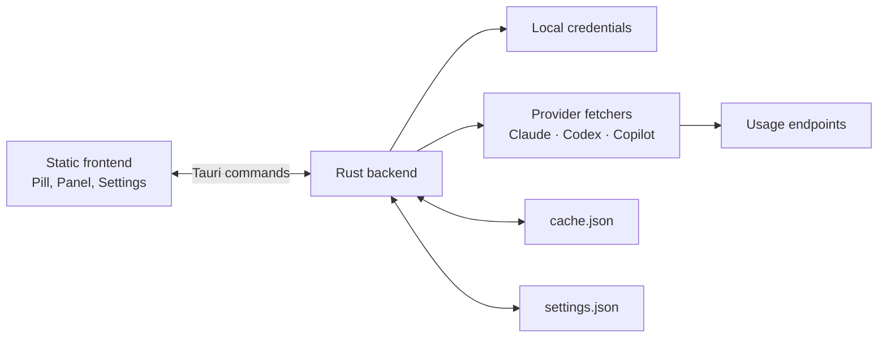

# AI Usage Notch

An always-on-top **Pill** that shows the usage of your **Claude**, **Codex** and
**GitHub Copilot** accounts at a glance. Percentages come from the credentials
the official CLIs already store on your machine, so there is no API key to paste
anywhere.

Built with [Tauri v2](https://v2.tauri.app/): a Rust backend and a static
HTML/CSS/JavaScript frontend, with no Node.js or frontend build step.

> [!IMPORTANT]
> Version `0.1.0`, **macOS-first**. The Windows bundle is built by the release
> pipeline but is not yet verified end to end. Linux is not a supported
> distribution target.

## Table of contents

- [Features](#features)
- [Providers and credentials](#providers-and-credentials)
- [Requirements](#requirements)
- [Install and run](#install-and-run)
- [Usage](#usage)
- [Settings](#settings)
- [Architecture](#architecture)
- [Development](#development)
- [Privacy and security](#privacy-and-security)
- [Troubleshooting](#troubleshooting)
- [Contributing](#contributing)
- [Known limitations](#known-limitations)
- [License](#license)

## Features

- Parallel monitoring of Claude, Codex and GitHub Copilot.
- Provider-specific usage percentages and reset windows.
- On-disk cache of the last known data, shown immediately at startup.
- Independent per-provider backoff (`30 s`, `5 min`, `15 min`) on error, honoring
  the `Retry-After` header on rate limits.
- Configurable automatic refresh plus an immediate manual refresh.
- Visual distinction between a never-configured provider, stale data and an
  error after a previous success.
- Visual alert and system notification past a configurable threshold.
- **Always** and **Auto-collapse** visibility modes.
- Configurable Pill scale (70%–200%) that resizes the Pill and its Panel alike.
- Draggable, persisted Pill position; initial placement next to the physical
  notch on compatible Macs.
- Automatic launch at login.

The **Pill** shows one ring per active provider. Clicking a ring opens its
**Panel**, with the per-window usage bars, the time to reset and any `unlimited`
or `overage` state.

## Providers and credentials

The app has no field to paste a token into. It looks for local credentials in
this order:

| Provider | Credential source | How to prepare it |
| --- | --- | --- |
| Claude | macOS: Keychain item `Claude Code-credentials`; other systems: `~/.claude/.credentials.json` | Run `claude login` |
| Codex | `~/.codex/auth.json` (`access_token` and `account_id`) | Run `codex login` |
| GitHub Copilot | `gh auth token`, then `GITHUB_TOKEN`, then `GH_TOKEN` | Run `gh auth login` with Copilot access |

Configuring a single provider is enough. Providers without valid credentials
stay grey and can also be disabled from the settings window.

The queried endpoints are undocumented and not dedicated to this project.
Formats and last-verified dates are recorded in
[`docs/endpoints.md`](docs/endpoints.md).

## Requirements

**Common**

- [Git](https://git-scm.com/)
- A stable Rust toolchain via [rustup](https://rustup.rs/)
- Tauri CLI v2: `cargo install tauri-cli --version "^2" --locked`
- At least one valid local credential (Claude Code, Codex or the GitHub CLI)

Node.js and npm are not needed.

**macOS**

- macOS with the system WebKit
- Xcode Command Line Tools: `xcode-select --install`

**Windows**

- Windows 10 or 11
- [Visual Studio Build Tools](https://visualstudio.microsoft.com/visual-cpp-build-tools/)
  with the **Desktop development with C++** workload
- [Microsoft Edge WebView2 Runtime](https://developer.microsoft.com/microsoft-edge/webview2/)
  (usually already present)

## Install and run

```sh
git clone https://github.com/sabhalo/ai-usage-notch.git
cd ai-usage-notch
```

Prepare at least one provider:

```sh
claude login
codex login
gh auth login
```

Run in development:

```sh
cargo tauri dev
```

Build an installable app:

```sh
cargo tauri build
```

Artifacts are created under `target/release/bundle/`:

- macOS: application in `macos/` and a `.dmg` in `dmg/`
- Windows: an NSIS `.exe` installer in `nsis/`

If there are no artifacts on the
[Releases](https://github.com/sabhalo/ai-usage-notch/releases) page yet,
building from source is the intended installation method.

## Usage

| Action | Result |
| --- | --- |
| Left click on a ring | Opens or closes that provider's Panel |
| Right click on the Pill | Forces an immediate refresh of every active provider, ignoring the current backoff |
| Hover on a collapsed Pill | Returns the Pill to its full size |
| Drag the Pill | Moves the window and saves the new position |
| Click the gear | Opens the settings |

The Panel closes after 7 seconds of inactivity or when the window loses focus.
An open Panel always keeps the Pill visible.

**Ring states**

- Green: usage below 70%
- Amber: usage from 70% to 89%
- Red: usage at 90% or above, or an error from a provider that had worked before
- Purple with `∞`: unlimited plan or quota
- Grey with `–`: provider not configured
- Dimmed: cached data older than 10 minutes, or the last value kept during a
  rate limit
- Pulsing: alert threshold reached

The threshold notification is sent once per usage cycle; a drop in the
percentage means the window reset and re-arms it.

## Settings

| Setting | Default | Notes |
| --- | ---: | --- |
| Active providers | All | Claude, Codex and Copilot are toggled separately |
| Refresh interval | 300 s | Minimum 30 s |
| Alert threshold | 80% | Between 1 and 100 |
| Scale | 100% | Continuous, 70%–200%; resizes the Pill and Panel |
| Visibility mode | Always | `Auto-collapse` collapses the Pill on inactivity |
| Auto-collapse delay | 3 s | Used only in `Auto-collapse` mode |
| Launch at login | Managed by the OS | Not stored in `settings.json` |

The window position is saved automatically. Without a saved position, macOS
tries to align the Pill with the left edge of the physical notch; otherwise it
centers it on the top edge of the primary monitor.

## Architecture



**Rust backend (`src/`)**

- `main.rs` — Tauri IPC surface, parallel fetches, window setup and placement
- `providers/` — the `UsageProvider` contract, shared types, parsers and one
  module per provider
- `credentials.rs` — per-platform local token resolution
- `cache.rs` — best-effort persistence of the last report
- `settings.rs` — loading, normalization and saving of preferences
- `notch.rs` — macOS notch safe-area detection via `objc2-app-kit`

**Static frontend (`dist/`)** — `index.html` / `main.js` / `style.css` for the
Pill, Panel, polling, backoff and notifications; `settings.*` for the settings
window; `icons/` for provider graphics. Editing a file under `dist/` directly
changes what Tauri serves and bundles.

```text
.
├── .github/workflows/release.yml  # release on v* tags
├── capabilities/default.json      # Tauri window permissions
├── dist/                          # static frontend
├── docs/                          # endpoints and project conventions
├── fixtures/                      # real payloads for the offline tests
├── icons/                         # desktop bundle icons
├── scripts/                       # manual Bash and PowerShell probes
├── src/                           # Rust backend
├── CONTEXT.md                     # canonical Pill/Panel vocabulary
└── tauri.conf.json                # windows, bundle and Tauri config
```

## Development

There is no `package.json`, `Makefile` or `justfile`; the project uses Cargo and
Cargo Tauri directly.

| Command | Purpose |
| --- | --- |
| `cargo tauri dev` | Compile and run in development |
| `cargo tauri build` | Build the release binary and bundles |
| `cargo test` | Run the offline test suite |
| `cargo fmt --check` | Check formatting |
| `cargo clippy --all-targets -- -D warnings` | Static analysis, warnings as errors |
| `./scripts/probe.sh` / `scripts/probe.ps1` | Query the three endpoints manually |

Before proposing a change, run `cargo fmt --check`, `cargo test`,
`cargo clippy --all-targets -- -D warnings` and `cargo build`. The release
pipeline runs the tests, Clippy and `cargo tauri build` on macOS and Windows;
there is no CI on ordinary pushes or pull requests, so run these locally.

Provider tests read `fixtures/<provider>-usage.json` and never touch the network
or the user's real credentials.

Pushing a tag that starts with `v` triggers `.github/workflows/release.yml`,
which builds on `macos-latest` and `windows-latest` and attaches the `.dmg` and
NSIS `.exe` to the matching GitHub Release.

To add a provider: create `src/providers/<id>.rs` (struct, `UsageProvider` impl,
parser, fixture tests), register it in `src/providers/mod.rs` and add it to
`SUPPORTED_PROVIDER_IDS` and the `tokio::join!` in `get_all_usage`, mirror the id
in `PROVIDER_IDS` in `dist/main.js`, add a fixture and the UI pieces under
`dist/`, and document the endpoint in `docs/endpoints.md`.

## Privacy and security

AI Usage Notch has no remote backend of its own. Tokens are read at request time
and sent only to the matching provider endpoint; they are never written to the
cache, the settings or the error messages.

Two files are saved in the system's user data directory (`~/Library/Application
Support/` on macOS, `%APPDATA%` on Windows):

| File | Content |
| --- | --- |
| `ai-usage-notch/settings.json` | Active providers, refresh, threshold, scale, visibility mode, delay and position |
| `ai-usage-notch/cache.json` | Timestamp and last report per provider, never credentials |

The Windows installer is not signed, so SmartScreen may warn on first run. On
macOS the transparent window uses `macos-private-api`, which rules out Mac App
Store distribution.

## Troubleshooting

**A provider is grey** — its credential was not found or is empty. Repeat the
login for that CLI and restart the app.

**Claude shows as not authenticated on macOS after login** — the Keychain can
hold more than one `Claude Code-credentials` item, and a stale MCP-only one may
be picked. In Keychain Access, remove the stale item after checking its
contents, then repeat `claude login`.

**Copilot cannot find `gh`** — check `gh auth status` and `gh auth token`, or
launch the app with `GITHUB_TOKEN` / `GH_TOKEN` set. The token must belong to an
account with Copilot access.

**"response received but no recognised field"** — an undocumented endpoint
likely changed format. Run `scripts/probe.sh` (or `probe.ps1`), compare with
`docs/endpoints.md`, update the parser under `src/providers/` and refresh the
fixture with a sanitized real payload.

**The data looks old** — the cache is shown at startup and marked stale after 10
minutes. A provider in error follows its backoff; right-click the Pill to force
an immediate attempt.

## Contributing

Issues and specs live in the
[GitHub tracker](https://github.com/sabhalo/ai-usage-notch/issues). The working
branch is `develop`; integration pull requests target `main`.

1. Open or pick an issue with context and acceptance criteria.
2. Branch from `develop`.
3. Keep the tests offline; do not read real user data in tests.
4. Run formatting, tests, Clippy and build.
5. Open a pull request against `main`, linking the issue.

The domain vocabulary is defined in [`CONTEXT.md`](CONTEXT.md); agent
conventions are in [`AGENTS.md`](AGENTS.md) and `docs/agents/`.

## Known limitations

- The usage endpoints are undocumented and can change without notice.
- Windows is built by the pipeline but not yet verified end to end.
- Linux has no configured bundle target.
- The Windows installers are not signed.
- No automatic updater.
- No CI on ordinary pushes and pull requests yet.

## License

The repository does not yet contain a `LICENSE` file. Without an explicit
license the code is not open source and cannot be reused or redistributed.
Contact the maintainer or wait for a license to be added.
