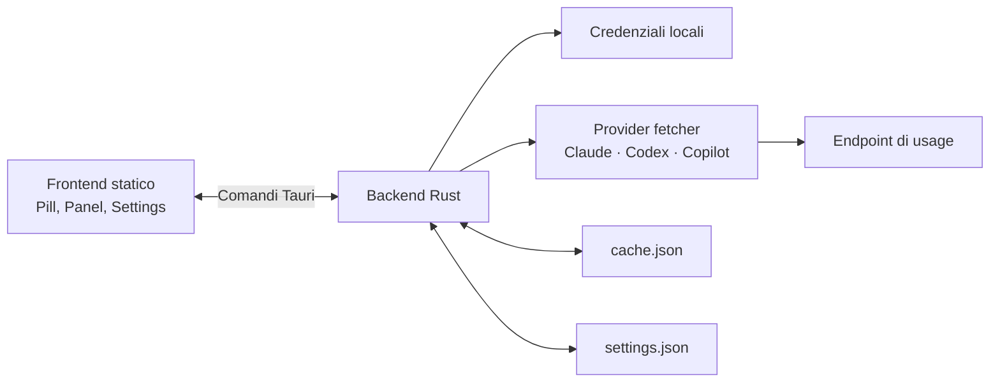

# AI Usage Notch

AI Usage Notch è una piccola applicazione desktop che mostra, in una **Pill**
sempre in primo piano, il consumo degli account **Claude**, **Codex** e
**GitHub Copilot**. Le percentuali arrivano dalle credenziali già create dalle
CLI ufficiali: non è necessario copiare API key nelle impostazioni dell'app.

Il progetto usa [Tauri v2](https://v2.tauri.app/) con backend Rust e frontend
HTML/CSS/JavaScript statico. Non richiede Node.js, npm o un passaggio di build
per il frontend.

> [!IMPORTANT]
> Il progetto è alla versione `0.1.0` ed è **macOS-first**. Il bundle Windows
> è configurato e viene compilato dalla pipeline di release, ma il porting è
> ancora in fase di verifica end-to-end. Linux non è attualmente un target di
> distribuzione supportato.

## Indice

- [Perché esiste](#perché-esiste)
- [Funzionalità](#funzionalità)
- [Provider e credenziali](#provider-e-credenziali)
- [Requisiti](#requisiti)
- [Installazione e avvio](#installazione-e-avvio)
- [Utilizzo](#utilizzo)
- [Impostazioni](#impostazioni)
- [Comandi e script](#comandi-e-script)
- [Architettura](#architettura)
- [Dati locali, privacy e sicurezza](#dati-locali-privacy-e-sicurezza)
- [Test e qualità](#test-e-qualità)
- [Build e release](#build-e-release)
- [Aggiungere un provider](#aggiungere-un-provider)
- [Risoluzione dei problemi](#risoluzione-dei-problemi)
- [Storia del progetto](#storia-del-progetto)
- [Contribuire](#contribuire)
- [Limiti noti](#limiti-noti)
- [Licenza](#licenza)

## Perché esiste

Claude, Codex e Copilot espongono finestre di utilizzo differenti e mostrano
le rispettive quote in interfacce separate. AI Usage Notch nasce per riunire
queste informazioni in un indicatore discreto, sempre raggiungibile e senza
richiedere un altro servizio remoto.

La **Pill** mostra un anello per ogni provider attivo. Selezionando un anello
si apre il relativo **Panel**, con le finestre di utilizzo, il tempo al reset e
gli eventuali stati `unlimited` o `overage`.

## Funzionalità

- monitoraggio parallelo di Claude, Codex e GitHub Copilot;
- percentuali e finestre di reset specifiche per provider;
- cache su disco dell'ultimo dato disponibile, caricata immediatamente
  all'avvio;
- backoff indipendente per provider (`30 s`, `5 min`, `15 min`) in caso di
  errore, con rispetto del `Retry-After` sui rate limit;
- refresh automatico configurabile e refresh manuale immediato;
- distinzione visiva tra provider mai configurato, dato non aggiornato ed
  errore dopo un precedente funzionamento;
- avviso visivo e notifica di sistema oltre una soglia configurabile;
- modalità di visibilità **Always** e **Auto-collapse**;
- posizione della Pill trascinabile e persistita;
- avvio automatico al login tramite plugin Tauri;
- posizionamento iniziale accanto alla notch fisica sui Mac compatibili;
- test dei parser completamente offline, basati su risposte reali salvate
  nelle fixture.

## Provider e credenziali

L'app non offre un campo in cui incollare token. Cerca invece le credenziali
locali in questo ordine:

| Provider | Origine credenziali | Come prepararle |
| --- | --- | --- |
| Claude | macOS: Keychain, voce `Claude Code-credentials`; altri sistemi: `~/.claude/.credentials.json` | Eseguire `claude login` |
| Codex | `~/.codex/auth.json` (`access_token` e `account_id`) | Eseguire `codex login` |
| GitHub Copilot | `gh auth token`, poi `GITHUB_TOKEN`, poi `GH_TOKEN` | Eseguire `gh auth login` e avere accesso a Copilot |

È sufficiente configurare un solo provider. Quelli senza credenziali valide
restano grigi e non impediscono agli altri di funzionare; possono anche essere
disattivati dalla finestra delle impostazioni.

Gli endpoint interrogati non sono API pubbliche e stabili dedicate a questo
progetto. Formati e date dell'ultima verifica sono documentati in
[`docs/endpoints.md`](docs/endpoints.md).

## Requisiti

### Comuni

- [Git](https://git-scm.com/);
- toolchain Rust stabile installata tramite [rustup](https://rustup.rs/);
- Tauri CLI v2;
- almeno una credenziale locale valida, normalmente ottenuta autenticando
  Claude Code, Codex o GitHub CLI.

Installare Tauri CLI con:

```sh
cargo install tauri-cli --version "^2" --locked
```

Non servono Node.js e npm.

### macOS

- macOS con WebKit di sistema;
- Xcode Command Line Tools:

  ```sh
  xcode-select --install
  ```

La lettura di Claude usa il comando di sistema `security`. La lettura di
Copilot cerca `gh` nel `PATH`, `/opt/homebrew/bin/gh` e
`/usr/local/bin/gh`, così funziona anche quando l'app viene aperta dal Finder.

### Windows

- Windows 10 o 11;
- [Visual Studio Build Tools](https://visualstudio.microsoft.com/visual-cpp-build-tools/)
  con il workload **Sviluppo di applicazioni desktop con C++**;
- [Microsoft Edge WebView2 Runtime](https://developer.microsoft.com/microsoft-edge/webview2/),
  normalmente già presente sui sistemi recenti.

Il supporto Windows è ancora sperimentale; vedere la
[mappa del porting](https://github.com/sabhalo/ai-usage-notch/issues/12) per
lo stato aggiornato.

## Installazione e avvio

### 1. Clonare il repository

```sh
git clone https://github.com/sabhalo/ai-usage-notch.git
cd ai-usage-notch
```

### 2. Preparare almeno un provider

Eseguire uno o più login, in base ai servizi da visualizzare:

```sh
claude login
codex login
gh auth login
```

### 3. Avviare in sviluppo

```sh
cargo tauri dev
```

Tauri compila il backend Rust e apre la Pill usando direttamente i file in
`dist/`. La prima compilazione può richiedere alcuni minuti.

### 4. Creare un'app installabile

```sh
cargo tauri build
```

Gli artefatti vengono creati sotto `target/release/bundle/`:

- macOS: applicazione in `macos/` e immagine `.dmg` in `dmg/`;
- Windows: installer NSIS `.exe` in `nsis/`.

Su macOS aprire il `.dmg` e trascinare l'app in `Applicazioni`. Su Windows
eseguire l'installer NSIS. Se non sono ancora presenti artefatti nella pagina
[Releases](https://github.com/sabhalo/ai-usage-notch/releases), la build da
sorgenti è il metodo di installazione previsto.

## Utilizzo

| Azione | Risultato |
| --- | --- |
| Click sinistro su un anello | Apre o chiude il Panel del provider |
| Click destro sulla Pill | Forza subito il refresh di tutti i provider attivi e ignora il backoff corrente |
| Hover su una Pill Collapsed | Esegue il Wake e riporta la Pill a Visible |
| Trascinamento della Pill | Sposta la finestra e salva la nuova posizione |
| Click sull'ingranaggio | Apre le impostazioni |

Il Panel si chiude dopo 7 secondi di inattività o quando la finestra perde il
focus. Un Panel Open mantiene sempre la Pill Visible.

### Significato degli stati

- verde: consumo inferiore al 70%;
- ambra: consumo dal 70% all'89%;
- rosso: consumo dal 90% o errore di un provider che aveva già funzionato;
- viola con `∞`: piano o quota illimitata;
- grigio con `–`: provider non configurato;
- aspetto attenuato: dato in cache vecchio di oltre 10 minuti o ultimo dato
  mantenuto durante un rate limit;
- pulsazione: soglia di allerta raggiunta.

La notifica di soglia viene inviata una sola volta per ciclo di utilizzo. Un
calo della percentuale indica il reset della finestra e riabilita la notifica.

## Impostazioni

| Impostazione | Default | Note |
| --- | ---: | --- |
| Provider attivi | Tutti | Claude, Codex e Copilot sono configurabili separatamente |
| Intervallo refresh | 300 secondi | Minimo 30 secondi nell'interfaccia |
| Soglia di allerta | 80% | Valore tra 1 e 100 |
| Visibility mode | `Always` | `Auto-collapse` abilita il collasso per inattività |
| Ritardo Auto-collapse | 3 secondi | Usato solo in modalità `Auto-collapse` |
| Avvia al login | Gestito dal sistema operativo | Non viene duplicato in `settings.json` |

La posizione della finestra viene salvata automaticamente. In assenza di una
posizione salvata, macOS tenta di allineare la Pill al bordo sinistro della
notch fisica; in alternativa la posiziona al centro del bordo superiore del
monitor principale.

## Comandi e script

Non sono presenti `package.json`, `Makefile` o `justfile`: il progetto usa
Cargo e Cargo Tauri direttamente.

| Comando | Scopo |
| --- | --- |
| `cargo tauri dev` | Compila e avvia l'app in modalità sviluppo |
| `cargo tauri build` | Crea il binario release e i bundle installabili |
| `cargo build` | Compila il backend senza creare bundle |
| `cargo test` | Esegue l'intera suite offline |
| `cargo test --locked` | Esegue i test usando esattamente `Cargo.lock`, come in CI |
| `cargo fmt` | Formatta il codice Rust |
| `cargo fmt --check` | Verifica la formattazione senza modificare file |
| `cargo clippy --all-targets -- -D warnings` | Esegue l'analisi statica trattando ogni warning come errore |
| `./scripts/probe.sh` | Interroga manualmente i tre endpoint su macOS/Linux |
| `powershell -ExecutionPolicy Bypass -File .\scripts\probe.ps1` | Interroga manualmente i tre endpoint su Windows |

Lo script shell richiede `curl` e `jq`. Entrambi gli script stampano il JSON
ricevuto ma non stampano mai il token. Le risposte possono comunque contenere
metadati dell'account: controllarle prima di condividerle.

## Architettura



### Backend Rust

- `src/main.rs`: superficie IPC Tauri, fetch parallele, setup delle finestre
  e posizionamento iniziale;
- `src/providers/`: contratto `UsageProvider`, tipi condivisi, parser e un
  modulo per provider;
- `src/credentials.rs`: risoluzione locale dei token per piattaforma;
- `src/cache.rs`: persistenza best-effort dell'ultimo report disponibile;
- `src/settings.rs`: caricamento, normalizzazione e salvataggio delle
  preferenze;
- `src/notch.rs`: rilevamento macOS della safe area della notch tramite
  `objc2-app-kit`.

I comandi esposti al frontend sono:

| Comando IPC | Responsabilità |
| --- | --- |
| `get_cached_usage` | Restituisce l'ultimo snapshot salvato |
| `get_settings` | Carica le impostazioni normalizzate |
| `save_settings` | Salva le impostazioni |
| `save_window_position` | Persiste le coordinate della Pill |
| `get_all_usage` | Interroga in parallelo i provider dovuti e aggiorna la cache |

### Frontend statico

- `dist/index.html`, `dist/main.js`, `dist/style.css`: Pill, Panel, polling,
  backoff, notifiche e layout;
- `dist/settings.html`, `dist/settings.js`, `dist/settings.css`: finestra
  delle impostazioni;
- `dist/icons/`: risorse grafiche dei provider.

Il frontend non ha una pipeline propria: modificare un file sotto `dist/`
aggiorna direttamente ciò che Tauri serve in sviluppo e inserisce nel bundle.

### Struttura del repository

```text
.
├── .github/workflows/release.yml  # release automatica su tag v*
├── capabilities/default.json      # permessi Tauri delle due finestre
├── dist/                          # frontend statico
├── docs/                          # endpoint e convenzioni di progetto
├── fixtures/                      # payload reali usati dai test offline
├── icons/                         # icone dei bundle desktop
├── scripts/                       # probe manuali Bash e PowerShell
├── src/                           # backend Rust
├── Cargo.toml                     # crate, dipendenze e profilo release
├── CONTEXT.md                     # vocabolario canonico Pill/Panel
└── tauri.conf.json                # finestre, bundle e configurazione Tauri
```

## Dati locali, privacy e sicurezza

AI Usage Notch non ha un backend remoto proprio. I token vengono letti al
momento della richiesta e inviati soltanto all'endpoint del relativo provider;
non vengono scritti nella cache, nelle impostazioni o nei messaggi di errore.

L'app salva due file nella directory dati utente del sistema:

| File | Contenuto |
| --- | --- |
| `ai-usage-notch/settings.json` | Provider attivi, refresh, soglia, visibility mode, ritardo e posizione |
| `ai-usage-notch/cache.json` | Timestamp e ultimo report per i provider supportati, mai credenziali |

Percorsi tipici della directory base:

- macOS: `~/Library/Application Support/`;
- Windows: `%APPDATA%`;
- Linux, se eseguito manualmente: `$XDG_DATA_HOME` oppure `~/.local/share/`.

In una build di debug il body grezzo di una risposta con formato inatteso può
essere scritto su `stderr` per la diagnosi. Non viene persistito dall'app.

## Test e qualità

I test dei provider leggono i file `fixtures/<provider>-usage.json` e non
contattano la rete. Non devono accedere né alle credenziali né ai file reali
dell'utente.

Prima di proporre una modifica eseguire:

```sh
cargo fmt --check
cargo test
cargo clippy --all-targets -- -D warnings
cargo build
```

La pipeline di release esegue `cargo test --locked`, Clippy e
`cargo tauri build` su macOS e Windows. Al momento non esiste un workflow CI
per i normali push o per le pull request, quindi questi controlli vanno
eseguiti localmente.

## Build e release

Il profilo release abilita LTO, una sola codegen unit, ottimizzazione per le
dimensioni e `panic = "abort"`.

Un push di un tag che inizia con `v` attiva
`.github/workflows/release.yml`. Il workflow:

1. compila e testa su `macos-latest` e `windows-latest`;
2. crea i bundle Tauri;
3. allega `.dmg` e installer NSIS `.exe` alla GitHub Release associata.

Esempio per un maintainer:

```sh
git tag v0.1.0
git push origin v0.1.0
```

> [!WARNING]
> L'installer Windows non è firmato. SmartScreen può mostrare “Windows ha
> protetto il PC”; verificare sempre provenienza e checksum prima di scegliere
> **Ulteriori informazioni → Esegui comunque**.

Su macOS la finestra trasparente usa `macos-private-api`. Questa scelta rende
possibile la Pill, ma esclude la distribuzione tramite Mac App Store.

## Aggiungere un provider

L'elenco autorevole del backend è `SUPPORTED_PROVIDER_IDS` in
`src/providers/mod.rs`; il frontend mantiene la lista speculare
`PROVIDER_IDS` in `dist/main.js`.

Per aggiungere un provider:

1. creare `src/providers/<id>.rs` con struttura, implementazione di
   `UsageProvider`, parser e test su fixture;
2. registrare modulo ed export in `src/providers/mod.rs`, aggiornare
   `SUPPORTED_PROVIDER_IDS` e aggiungere il provider al `tokio::join!` di
   `get_all_usage`;
3. aggiungere una risposta reale in `fixtures/<id>-usage.json`;
4. aggiungere icona, anello, titoli e stato in `dist/`;
5. aggiungere il checkbox nella finestra impostazioni;
6. documentare endpoint e payload in `docs/endpoints.md`;
7. eseguire l'intera checklist di qualità.

Impostazioni e cache filtrano automaticamente i provider sconosciuti durante
caricamento e salvataggio, evitando che integrazioni rimosse restino nei file
dell'utente.

## Risoluzione dei problemi

### Un provider è grigio

La relativa credenziale non è stata trovata o è vuota. Ripetere il login della
CLI interessata e riavviare l'app:

```sh
claude login
codex login
gh auth login
```

### Claude risulta non autenticato su macOS dopo il login

Nel Keychain possono esistere più voci chiamate `Claude Code-credentials`.
Una vecchia voce contenente solo dati MCP può essere scelta al posto di quella
OAuth. Aprire **Accesso Portachiavi**, individuare i duplicati e rimuovere solo
la voce obsoleta dopo averne verificato il contenuto; quindi ripetere
`claude login`.

### Copilot non trova `gh`

Verificare prima:

```sh
gh auth status
gh auth token
```

In alternativa avviare l'app con `GITHUB_TOKEN` o `GH_TOKEN` nell'ambiente.
Il token deve appartenere a un account con accesso a GitHub Copilot.

### Compare “response received but no recognised field”

È probabile che un endpoint non documentato abbia cambiato formato:

```sh
./scripts/probe.sh
```

Su Windows:

```powershell
powershell -ExecutionPolicy Bypass -File .\scripts\probe.ps1
```

Confrontare l'output con `docs/endpoints.md`, aggiornare il parser sotto
`src/providers/` e sostituire la fixture con un payload reale sanificato.

### I dati sembrano vecchi

La cache viene mostrata subito all'avvio e marcata come stale dopo 10 minuti.
Un provider in errore segue il proprio backoff; il click destro sulla Pill
forza un tentativo immediato.

### La build Tauri non parte

- verificare `rustc --version` e `cargo tauri --version`;
- su macOS verificare `xcode-select -p`;
- su Windows verificare l'installazione del workload C++ e di WebView2;
- eseguire `cargo build` per isolare prima eventuali errori Rust dal bundling.

## Storia del progetto

- **28 agosto 2026 — primo prototipo.** Nasce l'app Tauri con Pill statica,
  backend Rust e lettura delle quote Claude e Codex.
- **30 agosto 2026 — base operativa.** Arrivano GitHub Copilot, parser su
  fixture reali, cache, backoff per provider, errori tipizzati, refresh
  manuale, notifiche, impostazioni, trascinamento persistente e workflow di
  release macOS/Windows.
- **30 agosto 2026 — vocabolario e visibilità.** La vecchia modalità compact
  via doppio click viene rimossa. Nascono i due assi indipendenti: Pill
  Visible/Collapsed e Panel Open/Closed, con modalità Always e Auto-collapse.
- **31 agosto 2026 — esperimento Gemini.** Viene implementato un quarto
  provider tramite una sessione locale Antigravity e viene studiato anche
  l'endpoint Gemini CLI.
- **1 settembre 2026 — consolidamento.** Gemini viene rimosso deliberatamente;
  la fonte dei provider supportati viene centralizzata e cache e impostazioni
  vengono normalizzate per mantenere soltanto Claude, Codex e Copilot. Nello
  stesso periodo vengono formalizzate architettura e convenzioni per gli
  agenti di sviluppo.
- **Stato attuale.** macOS resta la piattaforma principale; la verifica del
  porting nativo Windows 11 è tracciata nelle issue del repository.

La cronologia dettagliata è disponibile nei
[commit](https://github.com/sabhalo/ai-usage-notch/commits/main/) e nelle
[issue](https://github.com/sabhalo/ai-usage-notch/issues).

## Contribuire

Issue e specifiche vivono nel tracker GitHub di
[`sabhalo/ai-usage-notch`](https://github.com/sabhalo/ai-usage-notch/issues).
Il branch di lavoro è `develop`; le pull request di integrazione puntano a
`main`.

Flusso consigliato:

1. aprire o scegliere una issue con contesto e criteri di accettazione;
2. creare un branch da `develop`;
3. mantenere i test offline e non leggere dati reali dell'utente nei test;
4. eseguire formattazione, test, Clippy e build;
5. aprire una pull request verso `main`, indicando la issue collegata.

Il vocabolario di dominio è definito in [`CONTEXT.md`](CONTEXT.md). Le
convenzioni destinate agli agenti sono in [`AGENTS.md`](AGENTS.md) e
`docs/agents/`.

## Limiti noti

- gli endpoint di utilizzo sono non documentati e possono cambiare senza
  preavviso;
- Windows è compilato dalla pipeline ma non è ancora considerato verificato
  end-to-end;
- Linux non dispone di un target bundle configurato;
- gli installer Windows non sono firmati;
- la private API usata dalla finestra trasparente impedisce la pubblicazione
  sul Mac App Store;
- non è presente un updater automatico;
- non esiste ancora CI sui normali push e sulle pull request.

## Licenza

Il repository non contiene ancora un file `LICENSE`. In assenza di una licenza
esplicita, il codice non può essere considerato open source né riutilizzato o
redistribuito automaticamente. Prima di farlo, contattare il maintainer o
attendere l'aggiunta di una licenza.
